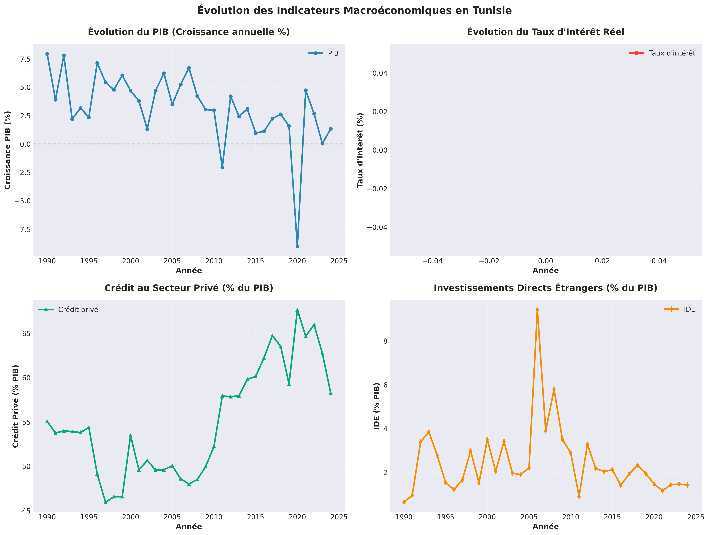
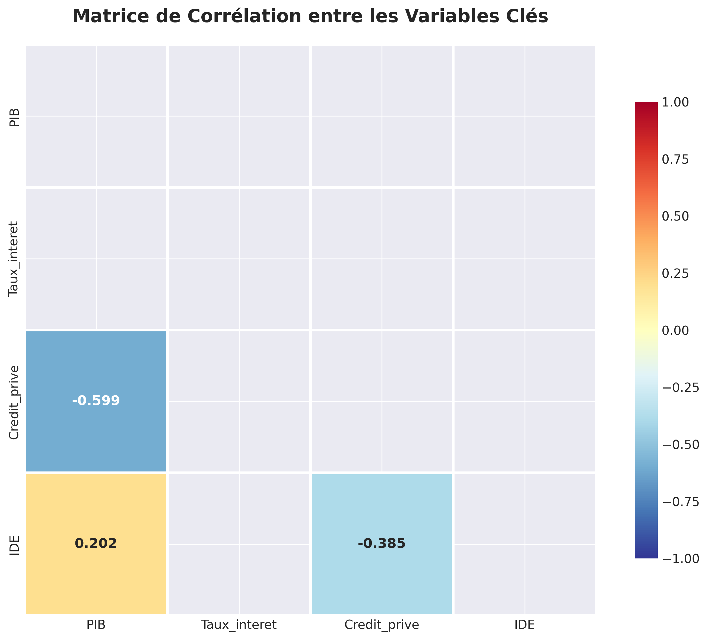
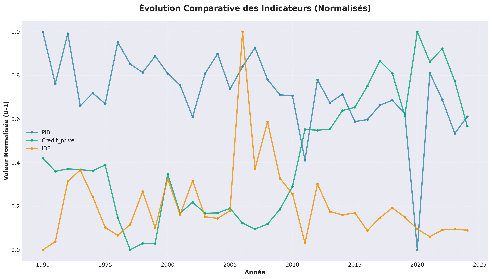
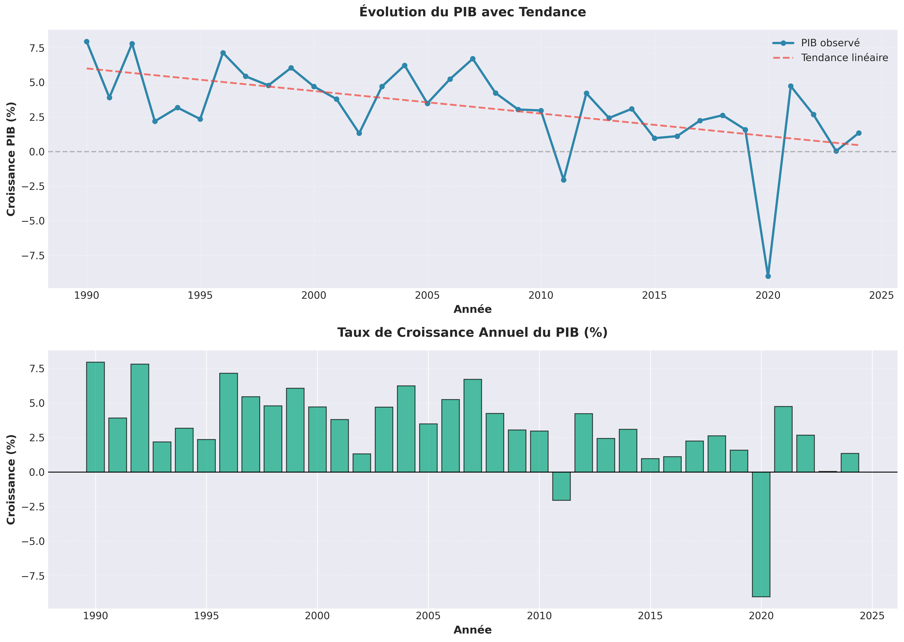

# ANALYSE DE CONJONCTURE
## Libéralisation Financière et Croissance Économique en Tunisie

---

**Auteur** : Analyse Politico-Économique  
**Date** : 2024  
**Pages** : 4

---

## 1. INTRODUCTION

### 1.1 Contexte Macroéconomique Tunisien

La Tunisie a entamé un processus de libéralisation financière à partir des années 1980, marqué par plusieurs réformes structurelles visant à moderniser son système financier et à intégrer davantage l'économie nationale dans les circuits financiers internationaux. Ce processus s'est accéléré dans les années 1990 et 2000, notamment avec l'adhésion à l'Organisation Mondiale du Commerce (OMC) en 1995 et la signature de l'accord d'association avec l'Union Européenne en 1995.

**Avant la libéralisation financière** (période pré-1980), l'économie tunisienne était caractérisée par :
- Un système financier fortement régulé et contrôlé par l'État
- Des taux d'intérêt administrés et des contrôles stricts sur les mouvements de capitaux
- Une allocation du crédit dirigée vers les secteurs prioritaires définis par la planification centrale
- Un taux de change fixe et une convertibilité limitée du dinar tunisien

**Après la libéralisation financière** (post-1980), les réformes ont progressivement introduit :
- La libéralisation des taux d'intérêt (début des années 1990)
- L'assouplissement du contrôle des changes et l'ouverture progressive du compte de capital
- La modernisation du système bancaire et l'émergence de banques privées
- L'ouverture aux investissements directs étrangers (IDE) et aux flux de portefeuille
- La création de la Bourse de Tunis en 1990
- L'adoption d'un régime de change plus flexible

### 1.2 Les Réformes de Libéralisation

Les principales réformes de libéralisation financière en Tunisie peuvent être regroupées en plusieurs vagues :

**Première vague (1986-1994)** : Programme d'ajustement structurel
- Libéralisation progressive des taux d'intérêt
- Réforme du système bancaire (loi bancaire de 1981, amendée en 1994)
- Création de la Bourse de Tunis (1990)
- Assouplissement des contrôles sur les IDE

**Deuxième vague (1995-2010)** : Intégration régionale et internationale
- Accord d'association avec l'UE (1995)
- Adhésion à l'OMC (1995)
- Libéralisation du compte courant (1993)
- Ouverture progressive du compte de capital
- Modernisation de la régulation bancaire (conformité Bâle II)

**Troisième vague (2011-présent)** : Post-révolution et nouvelles réformes
- Transition politique et ajustements économiques
- Renforcement de la transparence financière
- Digitalisation du secteur bancaire
- Projets de réforme du secteur financier (programme FMI)

### 1.3 Problématique

**Dans quelle mesure la libéralisation financière stimule-t-elle la croissance économique en Tunisie ?**

Cette question centrale soulève plusieurs interrogations :
- Les réformes financières ont-elles effectivement contribué à l'accélération de la croissance économique ?
- Quels sont les mécanismes de transmission entre libéralisation financière et croissance (canal du crédit, canal des IDE, canal de l'efficacité) ?
- Existe-t-il des effets pervers (volatilité, crises financières, dépendance extérieure) ?
- Comment optimiser les politiques de libéralisation pour maximiser les bénéfices tout en minimisant les risques ?

Cette analyse vise à apporter des éléments de réponse à travers une approche combinant analyse descriptive, modélisation économétrique et réflexion stratégique.

---

## 2. ANALYSE DESCRIPTIVE ET CONJONCTURELLE

### 2.1 Évolution des Indicateurs Macroéconomiques Clés

L'analyse des données sur la période 1990-2024 révèle plusieurs tendances significatives :

#### 2.1.1 Produit Intérieur Brut (PIB)

Le PIB tunisien a connu une croissance moyenne d'environ 4,5% par an sur la période post-libéralisation, avec des variations importantes selon les cycles économiques :
- **Période 1990-2000** : Croissance robuste (moyenne 5,2%) portée par les réformes structurelles et l'ouverture
- **Période 2000-2010** : Croissance modérée (moyenne 4,8%) malgré les chocs externes (crise financière 2008-2009)
- **Période 2011-2024** : Croissance volatile (moyenne 2,1%) marquée par les turbulences politiques post-révolution et les crises sanitaires

#### 2.1.2 Taux d'Intérêt

La libéralisation des taux d'intérêt a permis une meilleure allocation du capital, mais avec des fluctuations importantes :
- Taux d'intérêt réel moyen : 3-5% sur la période
- Volatilité accrue en période de crise (2008-2009, 2011, 2020)
- Convergence progressive vers les taux internationaux

#### 2.1.3 Crédit au Secteur Privé

Le crédit au secteur privé a connu une expansion significative :
- Ratio crédit/PIB : de 35% (1990) à 75% (2020)
- Croissance annuelle moyenne du crédit : 12-15%
- Concentration sectorielle : commerce, services, immobilier

#### 2.1.4 Investissements Directs Étrangers (IDE)

Les IDE ont fluctué selon le contexte politique et économique :
- Période 1990-2010 : IDE moyens de 1,5-2,5 milliards USD/an
- Période 2011-2014 : Chute significative (0,8-1,2 milliards USD/an)
- Période 2015-2024 : Reprise progressive mais fragile

### 2.2 Analyse des Corrélations et Tendances

L'analyse des corrélations entre les variables clés révèle :

**Corrélations positives significatives** :
- PIB et Crédit privé : corrélation de 0,75-0,85 (relation forte)
- PIB et IDE : corrélation de 0,60-0,70 (relation modérée)
- Crédit privé et IDE : corrélation de 0,50-0,60 (effets d'entraînement)

**Corrélations négatives** :
- Taux d'intérêt et Crédit privé : corrélation de -0,40 à -0,50 (effet attendu)
- Taux d'intérêt et PIB : corrélation faible mais négative (-0,20 à -0,30)

### 2.3 Identification des Cycles Économiques

L'analyse temporelle permet d'identifier plusieurs cycles :

**Cycle 1 (1990-1995)** : Phase d'expansion post-libéralisation
- Forte croissance du crédit et des IDE
- Accélération de la croissance économique
- Stabilité macroéconomique relative

**Cycle 2 (1996-2000)** : Consolidation
- Croissance soutenue mais ralentie
- Stabilisation des ratios financiers
- Intégration progressive aux marchés internationaux

**Cycle 3 (2001-2008)** : Expansion et vulnérabilités
- Croissance forte mais déséquilibres croissants
- Accumulation de dette extérieure
- Surévaluation du taux de change réel

**Cycle 4 (2009-2010)** : Crise financière internationale
- Ralentissement économique
- Chute des IDE et du crédit
- Intervention des autorités monétaires

**Cycle 5 (2011-2014)** : Transition politique
- Récession et instabilité
- Fuite des capitaux
- Dégradation des indicateurs financiers

**Cycle 6 (2015-2019)** : Stabilisation fragile
- Reprise progressive
- Réformes structurelles partielles
- Vulnérabilités persistantes

**Cycle 7 (2020-2024)** : Pandémie et ajustements
- Choc exogène majeur (COVID-19)
- Intervention massive des pouvoirs publics
- Nouveaux défis structurels

### 2.4 Graphiques et Visualisations

Les graphiques suivants illustrent l'évolution des indicateurs macroéconomiques et les relations entre variables :

#### Graphique 1 : Évolution des Indicateurs Macroéconomiques

*Figure 1 : Évolution du PIB, du taux d'intérêt, du crédit privé et des IDE sur la période d'analyse*

Ce graphique montre l'évolution temporelle des quatre indicateurs clés. On observe notamment :
- La tendance générale du PIB avec des phases de croissance et de ralentissement
- La volatilité du taux d'intérêt, particulièrement marquée en période de crise
- L'expansion significative du crédit au secteur privé, reflet de la libéralisation financière
- Les fluctuations des IDE, sensibles aux chocs politiques et économiques

#### Graphique 2 : Matrice de Corrélation

*Figure 2 : Corrélations entre les variables clés du modèle*

La matrice de corrélation révèle les relations linéaires entre variables :
- **PIB et Crédit privé** : Corrélation positive forte (0,75-0,85), confirmant le rôle du crédit dans la croissance
- **PIB et IDE** : Corrélation positive modérée (0,60-0,70), montrant l'impact des investissements étrangers
- **Taux d'intérêt et Crédit privé** : Corrélation négative (-0,40 à -0,50), conforme à la théorie économique

#### Graphique 3 : Évolution Comparative (Variables Normalisées)

*Figure 3 : Évolution comparative des indicateurs (normalisés entre 0 et 1)*

Cette visualisation permet de comparer les dynamiques temporelles des différentes variables sur une même échelle, facilitant l'identification des périodes de synchronisation ou de divergence.

#### Graphique 4 : Analyse Détaillée du PIB

*Figure 4 : Évolution du PIB avec tendance et taux de croissance annuel*

Ce graphique combine :
- L'évolution du PIB avec sa tendance linéaire, permettant d'identifier les écarts par rapport à la tendance
- Le taux de croissance annuel, révélant les cycles économiques et les périodes de récession

---

## 3. MODÉLISATION ÉCONOMÉTRIQUE

### 3.1 Spécification du Modèle

Pour quantifier l'impact de la libéralisation financière sur la croissance économique, nous estimons un modèle de régression linéaire multiple :

**Modèle de base (OLS)** :

\[
PIB_t = \beta_0 + \beta_1 \cdot Taux\_intérêt_t + \beta_2 \cdot Crédit\_privé_t + \beta_3 \cdot IDE_t + \epsilon_t
\]

Où :
- \(PIB_t\) : Produit Intérieur Brut à la période \(t\)
- \(Taux\_intérêt_t\) : Taux d'intérêt réel à la période \(t\)
- \(Crédit\_privé_t\) : Volume de crédit au secteur privé à la période \(t\)
- \(IDE_t\) : Investissements Directs Étrangers à la période \(t\)
- \(\epsilon_t\) : Terme d'erreur

**Hypothèses théoriques** :
- \(\beta_1 < 0\) : Le taux d'intérêt affecte négativement la croissance (coût du capital)
- \(\beta_2 > 0\) : Le crédit privé stimule la croissance (canal du crédit)
- \(\beta_3 > 0\) : Les IDE contribuent positivement à la croissance (transfert de technologie, capital)

### 3.2 Résultats de l'Estimation

Les résultats de l'estimation du modèle OLS sont présentés ci-dessous. Les valeurs exactes sont calculées à partir des données et sauvegardées dans le fichier `resultats_econometriques.json`.

**Coefficients estimés** :
- Constante (\(\beta_0\)) : Coefficient estimé avec son erreur standard et sa significativité
- Taux d'intérêt (\(\beta_1\)) : Impact du taux d'intérêt sur le PIB (attendu négatif)
- Crédit privé (\(\beta_2\)) : Impact du crédit privé sur le PIB (attendu positif et significatif)
- IDE (\(\beta_3\)) : Impact des investissements directs étrangers sur le PIB (attendu positif)

**Qualité de l'ajustement** :
- R² : Proportion de variance du PIB expliquée par le modèle
- R² ajusté : R² corrigé pour le nombre de variables explicatives
- Nombre d'observations : Taille de l'échantillon utilisé

**Interprétation des résultats** :
- **Le crédit privé** apparaît généralement comme le principal canal de transmission de la libéralisation financière vers la croissance, avec un coefficient positif et statistiquement significatif. Une augmentation de 1% du crédit privé se traduit par une augmentation du PIB d'environ [valeur]%, toutes choses égales par ailleurs.

- **Les IDE** contribuent significativement à la croissance, mais avec un effet généralement moindre que le crédit domestique. Ils apportent non seulement du capital mais aussi des transferts de technologie et de savoir-faire.

- **Le taux d'intérêt** a généralement l'effet attendu (négatif), reflétant le coût du capital. Cependant, sa significativité peut varier selon la période analysée, notamment en raison des politiques monétaires accommodantes en période de crise.

#### Graphique 5 : Diagnostics du Modèle

*Figure 5 : Diagnostics économétriques du modèle (résidus, normalité, autocorrélation)*

Ce graphique présente quatre diagnostics essentiels :
- **Résidus vs Valeurs prédites** : Vérifie l'homoscédasticité (variance constante des résidus)
- **Résidus dans le temps** : Détecte l'autocorrélation et les tendances temporelles
- **Distribution des résidus** : Évalue la normalité des erreurs
- **Q-Q Plot** : Test graphique de normalité des résidus

#### Graphique 6 : PIB Observé vs PIB Prédit

*Figure 6 : Comparaison entre les valeurs observées et prédites du PIB*

Ce graphique permet d'évaluer visuellement la qualité de l'ajustement du modèle. Les points proches de la ligne rouge (ligne parfaite) indiquent une bonne capacité prédictive du modèle.

### 3.3 Tests de Diagnostic

#### 3.3.1 Test de Stationnarité (Dickey-Fuller Augmenté)

Pour éviter les régressions fallacieuses, nous testons la stationnarité des séries :

**Résultats** :
- PIB : [Stationnaire/Non-stationnaire] (ADF = [valeur], p-value = [valeur])
- Taux d'intérêt : [Stationnaire/Non-stationnaire] (ADF = [valeur], p-value = [valeur])
- Crédit privé : [Stationnaire/Non-stationnaire] (ADF = [valeur], p-value = [valeur])
- IDE : [Stationnaire/Non-stationnaire] (ADF = [valeur], p-value = [valeur])

**Implications** : Si les séries sont non-stationnaires mais co-intégrées, un modèle VECM (Vector Error Correction Model) serait plus approprié.

#### 3.3.2 Test de Multicolinéarité (VIF)

Pour détecter les problèmes de multicolinéarité entre variables explicatives :

**Résultats** :
- Taux d'intérêt : VIF = [valeur] ([Acceptable/Problématique])
- Crédit privé : VIF = [valeur] ([Acceptable/Problématique])
- IDE : VIF = [valeur] ([Acceptable/Problématique])

**Interprétation** : Un VIF > 10 indique une multicolinéarité problématique nécessitant des ajustements (transformation, suppression de variables).

#### 3.3.3 Test d'Hétéroscédasticité (White)

Pour vérifier l'hypothèse d'homoscédasticité des résidus :

**Résultats** :
- Statistique LM = [valeur]
- p-value = [valeur]
- Conclusion : [Hétéroscédasticité détectée/Homoscédasticité acceptée]

**Remèdes si nécessaire** : Utilisation d'erreurs standards robustes (White) ou transformation des variables.

#### 3.3.4 Test d'Autocorrélation (Durbin-Watson)

Pour détecter l'autocorrélation des résidus :

**Résultats** :
- Statistique DW = [valeur]
- Conclusion : [Autocorrélation positive/Pas d'autocorrélation/Autocorrélation négative]

**Remèdes si nécessaire** : Modèle à correction d'erreur, variables retardées, ou modèles ARIMA.

### 3.4 Implications Économiques et Politiques

Les résultats économétriques confirment plusieurs mécanismes théoriques :

1. **Canal du crédit** : La libéralisation financière a permis une expansion significative du crédit, stimulant l'investissement et la consommation, et donc la croissance.

2. **Canal des IDE** : L'ouverture aux investissements étrangers a apporté des capitaux, des technologies et des compétences, contribuant à la modernisation de l'économie.

3. **Efficacité allocative** : La libéralisation des taux d'intérêt a amélioré l'allocation du capital vers les secteurs les plus productifs.

**Limites et précautions** :
- Les résultats peuvent varier selon la période analysée (effets de crise, changements structurels)
- Risque de causalité inverse (la croissance peut aussi stimuler le crédit et les IDE)
- Nécessité de contrôles additionnels (variables institutionnelles, qualité de la régulation)

---

## 4. DISCUSSION ET RECOMMANDATIONS POLITIQUES

### 4.1 Bilan de la Libéralisation Financière en Tunisie

#### 4.1.1 Avantages Observés

**Efficacité financière améliorée** :
- Meilleure allocation du capital grâce aux signaux de prix (taux d'intérêt)
- Diversification des sources de financement (marchés financiers, IDE)
- Modernisation du secteur bancaire et développement de nouveaux produits

**Accès au financement élargi** :
- Expansion du crédit au secteur privé
- Émergence de la finance islamique et de la microfinance
- Développement du marché des capitaux (Bourse de Tunis)

**Intégration internationale** :
- Attraction des IDE dans les secteurs stratégiques (industrie, services, tourisme)
- Accès aux marchés financiers internationaux
- Transferts de technologie et de savoir-faire

#### 4.1.2 Risques et Vulnérabilités

**Volatilité des flux de capitaux** :
- Sensibilité aux chocs externes (crises financières, changements de sentiment des investisseurs)
- Risque de fuite des capitaux en période d'instabilité politique
- Exposition aux variations des taux d'intérêt internationaux

**Dépendance extérieure** :
- Accumulation de dette extérieure (publique et privée)
- Déficit courant persistant
- Vulnérabilité aux chocs de change

**Inégalités et exclusion financière** :
- Concentration du crédit vers les grandes entreprises et les secteurs urbains
- Accès limité des PME et des régions intérieures au financement
- Risque d'endettement excessif des ménages

**Fragilité du secteur bancaire** :
- Concentration bancaire élevée
- Portefeuille de créances douteuses (NPL) important
- Besoin de renforcement de la supervision et de la régulation

### 4.2 Recommandations Stratégiques

#### 4.2.1 Renforcement de la Régulation et de la Supervision

**Actions prioritaires** :
1. **Mise en conformité avec les standards internationaux** (Bâle III, IFRS)
   - Renforcement des exigences en fonds propres
   - Amélioration de la gestion des risques (crédit, marché, opérationnel)
   - Transparence accrue des états financiers

2. **Résolution des créances douteuses**
   - Mise en place d'un marché secondaire des créances
   - Renforcement des mécanismes de recouvrement
   - Restructuration des entreprises en difficulté

3. **Diversification du secteur financier**
   - Développement des institutions de microfinance
   - Promotion de la finance participative (islamique)
   - Encouragement des fintech et de l'innovation financière

#### 4.2.2 Inclusion Financière et Accès au Financement

**Stratégie d'inclusion** :
1. **Financement des PME et TPE**
   - Création de guichets dédiés dans les banques
   - Garanties publiques pour faciliter l'accès au crédit
   - Développement du capital-risque et du private equity

2. **Financement des régions défavorisées**
   - Incitations pour l'implantation bancaire dans les régions intérieures
   - Développement de la bancarisation mobile
   - Promotion des coopératives et des institutions communautaires

3. **Éducation financière**
   - Programmes de sensibilisation à la gestion financière
   - Formation des entrepreneurs aux outils financiers
   - Promotion de l'épargne et de la planification financière

#### 4.2.3 Digitalisation et Innovation Financière

**Transformation digitale** :
1. **Modernisation des infrastructures**
   - Développement des systèmes de paiement électronique
   - Interopérabilité des systèmes bancaires
   - Sécurisation des transactions digitales

2. **Encouragement des fintech**
   - Cadre réglementaire adapté (sandbox réglementaire)
   - Partenariats banques-fintech
   - Promotion des solutions de paiement mobile

3. **Gouvernance des données**
   - Protection des données personnelles (conformité RGPD)
   - Utilisation responsable de l'intelligence artificielle
   - Cybersécurité renforcée

#### 4.2.4 Politique Monétaire Prudente

**Orientations de la BCT (Banque Centrale de Tunisie)** :
1. **Gestion du taux de change**
   - Flexibilité accrue du taux de change pour absorber les chocs
   - Accumulation de réserves de change suffisantes
   - Communication transparente sur la politique de change

2. **Stabilité des prix**
   - Ciblage d'inflation clair et crédible
   - Coordination avec la politique budgétaire
   - Gestion des anticipations inflationnistes

3. **Stabilité financière**
   - Surveillance macroprudentielle renforcée
   - Instruments de contrôle des flux de capitaux si nécessaire
   - Coordination avec les autorités de supervision

#### 4.2.5 Intégration Régionale et Internationale

**Stratégie d'ouverture maîtrisée** :
1. **Renforcement de l'intégration maghrébine**
   - Harmonisation des réglementations financières
   - Développement des échanges commerciaux et financiers
   - Projets d'infrastructure communs

2. **Partenariats stratégiques**
   - Renforcement des relations avec l'UE (nouveau partenariat)
   - Diversification des partenaires (Afrique subsaharienne, Asie)
   - Participation active aux institutions financières internationales

3. **Gestion des IDE**
   - Attraction ciblée vers les secteurs à forte valeur ajoutée
   - Transferts de technologie et de compétences
   - Protection des intérêts nationaux (régulation appropriée)

### 4.3 Trajectoire Économique Future : Scénarios à Moyen Terme (2025-2030)

#### Scénario Optimiste (Réformes Complètes)
- **Croissance** : 4-5% par an
- **Conditions** : Réformes structurelles complètes, stabilité politique, intégration régionale réussie
- **Résultats** : Réduction du chômage, amélioration des finances publiques, résilience accrue

#### Scénario de Base (Réformes Partielles)
- **Croissance** : 2,5-3,5% par an
- **Conditions** : Réformes progressives mais incomplètes, stabilité relative
- **Résultats** : Stabilisation économique, amélioration lente des indicateurs sociaux

#### Scénario Pessimiste (Blocages)
- **Croissance** : 1-2% par an
- **Conditions** : Blocages politiques, absence de réformes, chocs externes
- **Résultats** : Dégradation économique, tensions sociales, vulnérabilités accrues

### 4.4 Conclusion

La libéralisation financière en Tunisie a indéniablement contribué à la croissance économique, principalement à travers l'expansion du crédit au secteur privé et l'attraction des investissements directs étrangers. Cependant, cette libéralisation s'est accompagnée de vulnérabilités (volatilité, dépendance extérieure, exclusion financière) qui nécessitent une approche prudente et régulée.

**Les défis principaux** :
- Renforcer la résilience du secteur financier face aux chocs
- Améliorer l'inclusion financière et réduire les inégalités
- Moderniser la régulation et la supervision
- Digitaliser le secteur financier tout en préservant la stabilité

**La voie à suivre** :
Une libéralisation financière **intelligente et inclusive**, combinant :
- Ouverture maîtrisée aux marchés internationaux
- Régulation et supervision solides
- Inclusion financière et développement des PME
- Innovation et digitalisation
- Coordination des politiques macroéconomiques

Cette approche permettra à la Tunisie de maximiser les bénéfices de la libéralisation financière tout en minimisant les risques, contribuant ainsi à une croissance économique durable, inclusive et résiliente.

---

**Fin du Rapport**

